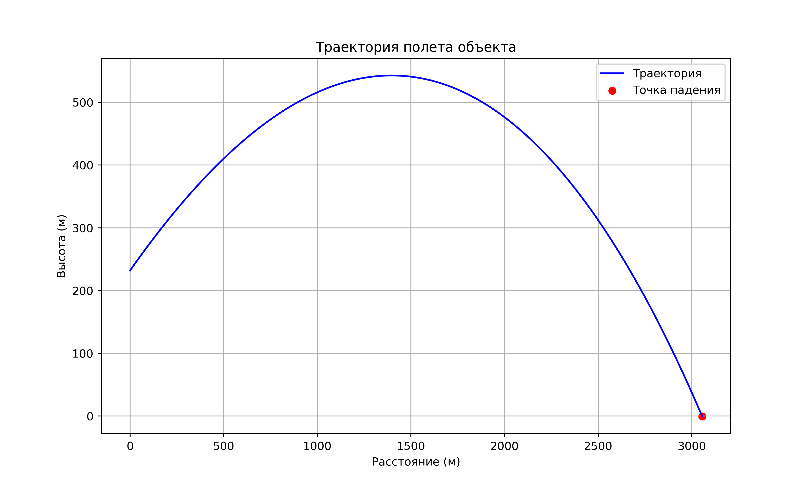

# 🚀ExpFiz - Телеграм-бот для моделирования полёта шара

[](https://python.org)
[](https://core.telegram.org/bots/api)
[](LICENSE)



## 📌 О проекте
ExpFiz — это образовательный Telegram-бот для моделирования физических экспериментов. Он рассчитывает параметры полёта тела (время, дальность, высоту) и строит график траектории по данным пользователя. 

**Цель**: Сделать изучение физики интерактивным и доступным через мессенджер.

## ✨ Возможности
- 📊 Расчет ключевых параметров полёта:
  - Время полёта
  - Максимальная высота
  - Дальность
- 📈 Построение графика траектории
- 🤖 Простой интерфейс в Telegram

## 🛠 Технологии
| Технология | Назначение |
|------------|------------|
| `python-telegram-bot` | Работа с Telegram API |
| `matplotlib` | Визуализация графиков |
| `numpy` | Математические расчеты |
| `DeepSeek` | Оптимизация кода |

# 🚀 Быстрый старт
```bash
# 1. Клонирование репозитория

git clone https://github.com/alexyeti/expfiz.git
cd expfiz

# 2. Установите библиотеки
pip install numpy matplotlib python-telegram-bot


# 3. Настройте бота
echo "BOT_TOKEN=ваш_токен" > .env

# 4. Запустите!
python bot.py
```

## Пример взаимодействия с ботом:
#### Запустите бота в Telegram.
#### Отправьте параметры полёта
#### Бот ответит расчётами и графиком траектории.

## Будущее развитие:
#### Добавление сопротивления воздуха и других физических факторов
#### Различные типы снарядов
#### Многоязычный интерфейс
#### Внедрение ИИ
# Контакты
Если у вас есть вопросы или предложения, вы можете связаться со мной:

[GitHub](https://github.com/alexyeti)

Telegram: @durqsous

### Если хотите, могу помочь с примером кода для запуска. Просто скажите!
